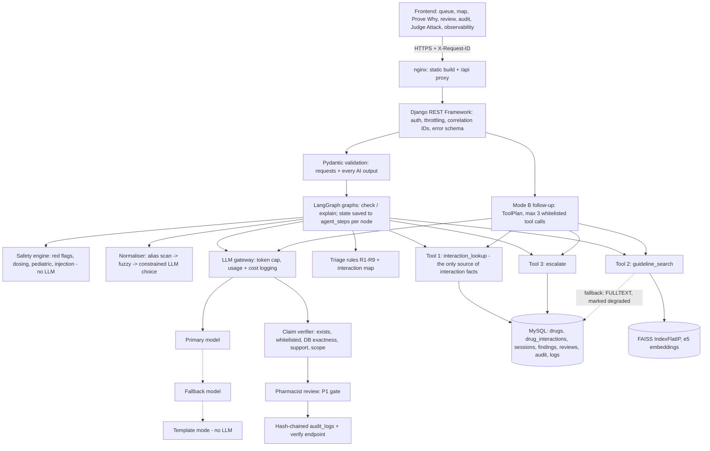

# RxGuard architecture

The LLM explains · tools provide facts · deterministic rules make safety-critical decisions · the pharmacist decides.

## Request paths

| Path | LLM on the normal path? | What happens |
|---|---|---|
| `POST /api/v1/check` | No (only for lines the dictionary cannot match) | validate → safety pre-check → alias scan → fuzzy → Tool 1 (one SQL query over all pairs + duplication) → triage R1–R9 → persist → escalations → audit |
| `POST /api/v1/explain` | One batched call per prescription | resume `/check` state → Tool 2 per finding (drug prefilter → FAISS → threshold → one expansion retry) → one structured LLM call on findings + whitelisted chunks only → verifier → escalations → audit |
| `POST /api/v1/ask` | Router + answer (≤3 calls incl. both) | safety pre-check (refusals before any LLM) → session reference resolution → ToolPlan → read-only tools → cited claims → verifier |

## Deployment shape

Three services from `docker-compose.yml`: **web** (Django + gunicorn, FAISS loaded in-process from a volume, the
embedding model baked into the image and warmed at start), **mysql** (MySQL 8.4, volume, healthcheck) and
**frontend** (nginx serving the React build and proxying `/api`, `/healthz`, `/readyz`). HTTPS is terminated by
Caddy (`--profile https`) on the VM. A separate vector database is not used: at ~530 chunks an exact
`IndexFlatIP` search takes milliseconds, and one fewer service means one fewer failure mode.

## Failure policy (implemented)

| Condition | Behaviour |
|---|---|
| MySQL unavailable | 503 "Interaction database unavailable. No check performed." — never an LLM fallback |
| FAISS unavailable | MySQL FULLTEXT on `corpus_chunks.text` (stricter: chunk must mention every drug of the pair), marked degraded |
| LLM error / timeout / refusal | fallback model → template mode; findings never depend on the LLM |
| LLM output fails Pydantic | retry once with the validation error → fallback model → template |
| Verifier drops every claim | template explanation + raw evidence cards |
| Token/call cap reached | stop; template for the rest |
| Tool timeout | one retry → structured failure on the card (Tool 1 → fail closed) |
